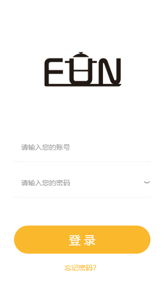
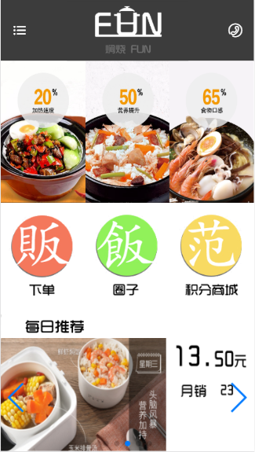
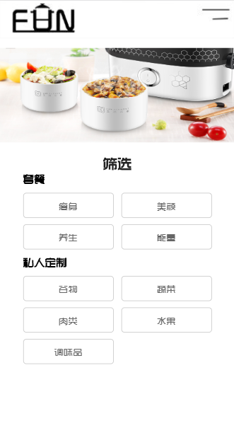
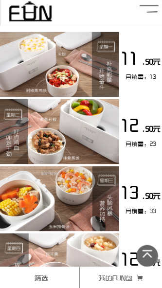
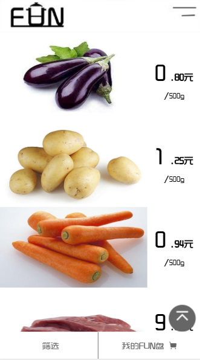
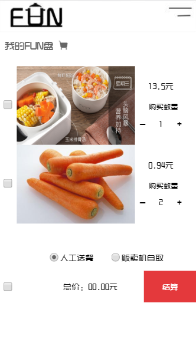
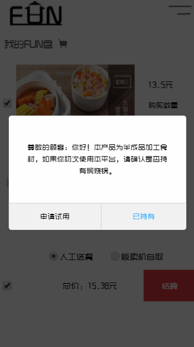
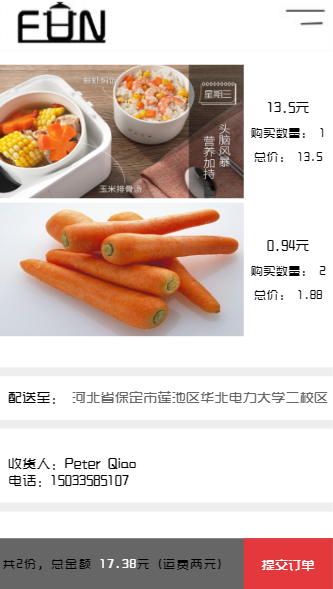
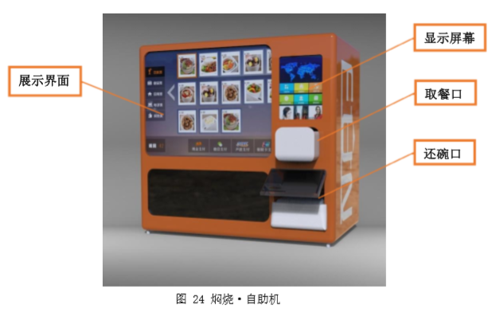
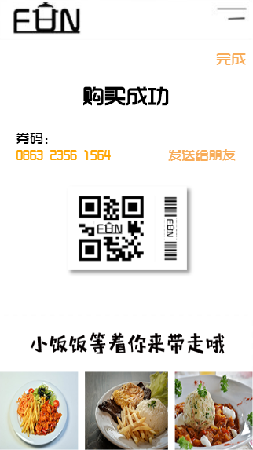

## 焖烧饭项目

> 本项目基本功能为线上选择食谱菜单，线下取餐，利用焖烧锅自制菜品。
本项目为大一下学期所做，基于cyy学姐创业想法所实现，参加互联网+比赛，得到河北省三等奖
之后进行了些许完善，又参加了创青春（初赛淘汰），2019年准备参加三创比赛。
由于项目逻辑不严谨，因此只完成了基本点餐功能和个别页面的跳转，类似于一个小商城。

### **1.开发历程**

*（2018-06）* 由于最开始开发此项目时未学后台，最开始只是采用了静态页面的方式，固定选择几个菜品且购物车页面写固定，完成了基本的展示功能。
*（2018-07）* 顺利通过校内初赛晋级河北省赛，考虑结合后台一起完成，但是遇到逻辑不严谨和项目疑点多等问题，且最后并未入围现场赛，因此后台搁置。
*（2018-10）* 为参加创青春比赛，进行了项目的进一步完善，为了实现项目的灵活性，采用了cookie存储用户选择菜品并在购物车一并展示进行相应的付款。
*（2019-03）* 利用Android Studio打包成APK为三创比赛做准备。 

### **2.最终项目流程**

测试用户为：焖烧饭  menshaofan（分别为用户名和密码）
[详情地址](https://starry-hu.github.io/menshao/login.html)
在购物车界面可选择**两种取餐**方式

1. 人工送餐，由周围同学进行配送，选择心仪的配送员。
2. 贩卖机自取，本项目设想了一个类似于自动售卖饮料的机器进行餐品的存取，用户可以自己选择就近的取餐点进行自取。

理论上用户拿到为食材，需要自己租用焖烧锅进行加水焖煮即可，因此还需租用或者购买焖烧锅，同时可以在配送人员送餐时归还焖烧锅或主动归还入机器。

### **3.项目截图流程**

#### 3.1 登录：（用户名：焖烧饭，密码：menshaofan）

#### 3.2 首页

#### 3.3 筛选列表
选择种类样式

#### 3.4 菜单（套餐和菜品）

#### 3.5 购物车

#### 3.6 下单提示

#### 3.7 人工送餐

#### 3.8 自助取餐

#### 3.9 结束

以上为大致的基本流程

### **4.项目疑惑点**

 - 焖烧锅的租用情况，以及清洗回收押金问题。
 - 食材的安全性保证。
 - 食材单位的度量选择，如何统一，如何进行合理的收费。
 - 等
 
### **5.收获**

 - 第一次用自己的项目参加比赛，虽然不是很完备，但是基本功能完成
 - 采用了minimobile进行移动端的开发
 - 使用了cookie实现纯前端网页的数据交互（需要注意chrome浏览器不允许本地文件传递cookie，因此选择挂载到github服务器上边）
 - 对于商城类项目有了一个基础开发
 - 学会了Android Studio将H5封装成APP（一是服务器页面方法，二是本地页面方法）

